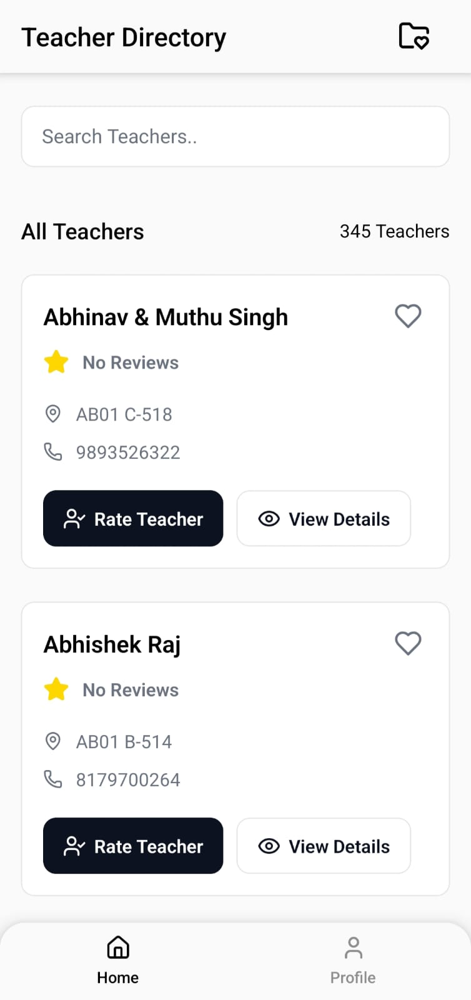
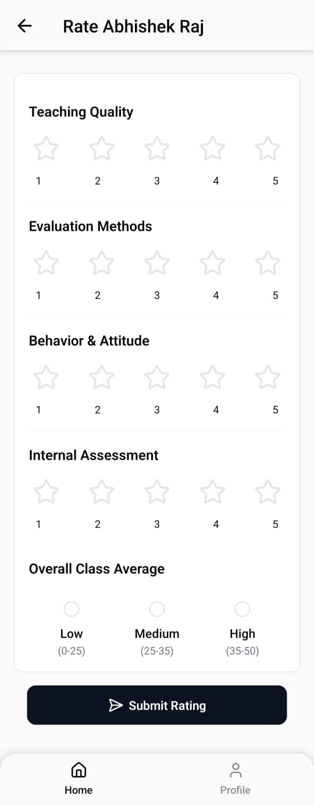
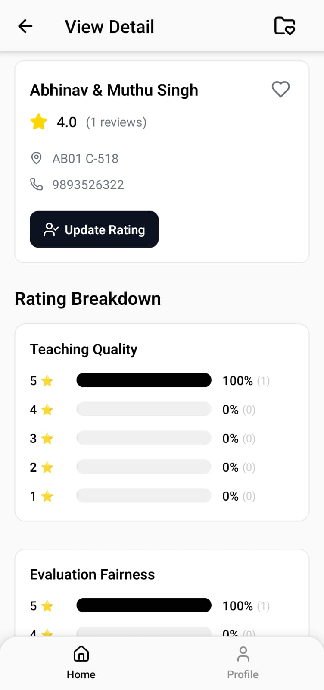

# Vitsify - Teacher Management System

**A modern React Native application for managing and rating teachers**

[](https://expo.dev/)
[](https://reactnative.dev/)
[](https://www.typescriptlang.org/)
[](https://supabase.com/)

</div>

---

## 🌟 Overview

**Vitsify** is a comprehensive teacher management and rating system built with React Native and Expo. The application enables students to discover, rate, and manage their favorite teachers while providing a seamless authentication flow and real-time data synchronization.

### Key Highlights

- 🔐 **Secure Authentication** - OAuth integration with session persistence
- ⭐ **Teacher Ratings** - Multi-dimensional rating system (Teaching, Evaluation, Behavior, Internals)
- 💝 **Favorites Management** - Bookmark and track favorite teachers
- 📊 **Real-time Updates** - Live data synchronization using Supabase Realtime
- 🎨 **Modern UI/UX** - Clean, intuitive interface with dark/light theme support
- 📱 **Cross-Platform** - Runs on iOS, Android, and Web
  
---

## 📸 Screenshots

<div align="center">

### Application Interface

<table>
  <tr>
    <td></td>
    <td></td>
    <td></td>
  </tr>
</table>

*Experience the clean and intuitive user interface of Vitsify*

</div>

---

## 🛠 Tech Stack

### Frontend

| Technology | Version | Purpose |
|------------|---------|---------|
| **React Native** | 0.79.6 | Cross-platform mobile framework |
| **Expo** | ~53.0.23 | Development platform and build tools |
| **TypeScript** | 5.8.3 | Type-safe development |
| **Expo Router** | ~5.1.7 | File-based navigation |
| **React Query** | 5.83.0 | Server state management |
| **Reanimated** | ~3.17.4 | Smooth animations |

### Backend & Services

| Technology | Purpose |
|------------|---------|
| **Supabase** | Backend-as-a-Service (BaaS) |
| **PostgreSQL** | Relational database |
| **Supabase Auth** | Authentication service |
| **Supabase Realtime** | Real-time subscriptions |

### UI & Styling

- **Lucide React Native** - Icon library
- **React Native SVG** - SVG rendering
- **Custom themed components** - Consistent design system

### Development Tools

- **EAS (Expo Application Services)** - Build and deployment
- **Jest** - Unit testing framework
- **ESLint & TypeScript** - Code quality and type checking

---

## 📁 Project Structure

```
TeacherManagement/
├── src/
│   ├── app/                      # Expo Router pages
│   │   ├── (auth)/              # Authentication screens
│   │   │   ├── _layout.tsx
│   │   │   └── signin.tsx
│   │   ├── (tabs)/              # Main app tabs
│   │   │   ├── _layout.tsx
│   │   │   ├── home/            # Home tab screens
│   │   │   └── profile/         # Profile tab screens
│   │   ├── providers/           # Context providers
│   │   │   ├── AuthProvider.tsx
│   │   │   ├── FavoriteProvider.tsx
│   │   │   ├── QueryProvider.tsx
│   │   │   └── ThemeProvider.tsx
│   │   ├── _layout.tsx          # Root layout
│   │   ├── +html.tsx            # Web HTML template
│   │   ├── +not-found.tsx       # 404 page
│   │   └── index.tsx            # Entry point
│   │
│   ├── api/                     # API hooks and queries
│   │   └── teachers/
│   │       ├── index.tsx        # Teacher queries
│   │       ├── profile.tsx      # User profile queries
│   │       ├── rating.tsx       # Rating mutations
│   │       └── reportBug.tsx    # Bug reporting
│   │
│   ├── components/              # Reusable components
│   │   ├── teacherManagement/
│   │   │   ├── Button.tsx
│   │   │   ├── CustomTextInput.tsx
│   │   │   ├── GoogleButton.tsx
│   │   │   ├── RatingBarChart.tsx
│   │   │   ├── RatingCategories.tsx
│   │   │   ├── TeacherCard.tsx
│   │   │   └── Toast.tsx
│   │   ├── Themed.tsx
│   │   └── useColorScheme.ts
│   │
│   ├── constants/               # App constants
│   │   └── Colors.ts
│   │
│   ├── hooks/                   # Custom React hooks
│   │   └── useRealtimeTeachers.ts
│   │
│   ├── libs/                    # Libraries and utilities
│   │   ├── auth.ts
│   │   ├── supabase.ts
│   │   └── toastService.ts
│   │
│   ├── database.types.ts        # Generated Supabase types
│   └── types.ts                 # Custom TypeScript types
│
├── assets/                      # Static assets
│   ├── fonts/
│   └── images/
│
├── android/                     # Native Android code
├── supabase/                    # Supabase configurations
│   ├── functions/
│   └── migrations/
│
├── app.json                     # Expo configuration
├── eas.json                     # EAS Build configuration
├── package.json                 # Dependencies
└── tsconfig.json               # TypeScript configuration
```

---

## 📄 License

This project is licensed under the **MIT License** - see the [LICENSE](LICENSE) file for details.

---

## 👨‍💻 Author

**Uditya Agrawal**

- GitHub: [@uditya2004](https://github.com/uditya2004)
- Expo: [@uditya204](https://expo.dev/@uditya204)

---

## 🙏 Acknowledgments

- [Expo](https://expo.dev/) - Amazing development platform
- [Supabase](https://supabase.com/) - Fantastic BaaS solution
- [React Query](https://tanstack.com/query) - Powerful data synchronization
- [Lucide Icons](https://lucide.dev/) - Beautiful icon library

---

<div align="center">

**⭐ Star this repo if you find it helpful!**

Made with ❤️ using React Native and Expo

</div>
